# Entropy-Aware Neuroplastic Learning

**A neural network that autonomously grows and prunes itself using information-theoretic signals — simulating biological neuroplasticity in silico.**

> *When a human learns something difficult, they literally form new synaptic connections. This project asks: what if artificial neural networks could do the same?*

**Author:** Evam Kaushik · University of Adelaide  
**Framework:** PyTorch (Colab-ready) + Pure NumPy (reference)  
**Dataset:** CIFAR-10

---

## Core Concept

Instead of pre-specifying a fixed architecture, we start with a small network and let it *grow itself*. Four information-theoretic (IT) signals continuously monitor whether the model's representations have saturated relative to the data's geometric complexity:

| Signal | What It Measures | Biological Analogy |
|--------|-----------------|-------------------|
| **Effective Rank** | Spectral diversity of learned representations (SVD entropy) | Synaptic diversity |
| **Fisher Information Trace** | Parameter sensitivity — how much each weight matters | Neural sensitivity |
| **Mutual Information I(T;Y)** | How much the hidden layer "knows" about the target | Cortical encoding efficiency |
| **TwoNN Intrinsic Dimensionality** | Geometric complexity of the representation manifold | Representational capacity |

When these signals indicate struggle, the system autonomously triggers **growth** (adding neurons/layers via Net2Net expansion) or **pruning** (removing redundant neurons via cosine triage + importance scoring).

---

## Architecture

The final system combines five biologically-inspired components:

```
┌─────────────────────────────────────────────────────────┐
│                   NeuroplasticityNet                     │
│                                                         │
│  ┌──────────────────────────────────────────┐           │
│  │  Conv Front-End  (Visual Cortex V1/V2)   │           │
│  │  Conv2d(3→16) → BN → ReLU               │           │
│  │  Conv2d(16→32) → BN → ReLU → MaxPool    │           │
│  │  Conv2d(32→64) → BN → ReLU → MaxPool    │           │
│  └──────────────┬───────────────────────────┘           │
│                 │ GAP + flatten                          │
│  ┌──────────────▼───────────────────────────┐           │
│  │  Growing Skip-MLP  (Cortical Highways)    │           │
│  │  ┌─────────────────────────────────┐     │           │
│  │  │ ResBlock: FC→BN→ReLU→FC→BN + skip │   │           │
│  │  │        × n_blocks (grows)         │   │           │
│  │  └─────────────────────────────────┘     │           │
│  │  Width: 64 → 352  (autonomous growth)    │           │
│  └──────────────┬───────────────────────────┘           │
│                 │                                        │
│  ┌──────────────▼───────────────────────────┐           │
│  │  Classifier Head → 10 classes             │           │
│  └──────────────────────────────────────────┘           │
│                                                         │
│  Growth Controller  (dual-score: width vs depth)        │
│  Synaptic Pruning   (cosine triage → neuron importance) │
│  GradCAM Snapshots  (neural imaging at every event)     │
└─────────────────────────────────────────────────────────┘
```

---

## Results — Experiment 6 (120 epochs, CIFAR-10)

### Headline Numbers

| Metric | Start (Epoch 1) | End (Epoch 120) |
|--------|:---:|:---:|
| Architecture | Conv[16,32,64] + MLP w=64, b=2 | Conv[16,32,64] + MLP w=352, b=2 |
| Parameters | 45,786 | 550,650 |
| Train Accuracy | 37.4% | 89.8% |
| Test Accuracy | 38.7% | 77.8% |
| Effective Rank | 36.6 | 142.1 (3.9×) |
| Rep ID | 10.7 | 26.5 (Data ID = 49.2) |
| Growth Events | — | 9 width expansions |
| Prune Events | — | 0 (gap stayed below 18%) |

### Accuracy, Loss & Capacity Growth

<p align="center">
  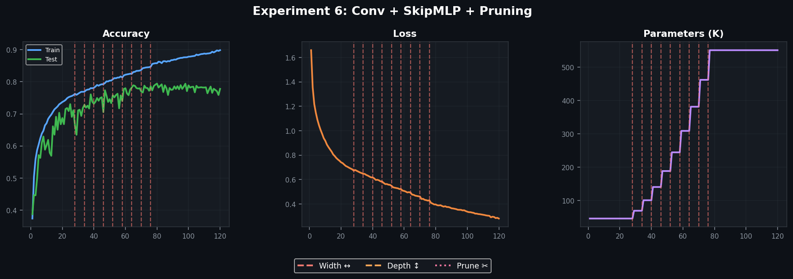
</p>

<p align="center"><em>Train accuracy climbed from 37.4% to 89.8% with a clear staircase pattern — each growth event triggers a brief acceleration as new neurons specialise. Test accuracy followed to 77.8%. Red dashed lines mark growth events. No pruning fired — the conv front-end's inductive bias provided implicit regularisation.</em></p>

### Information-Theoretic Signals

<p align="center">
  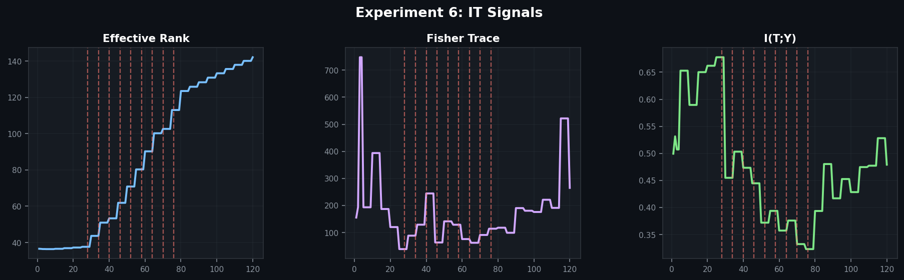
</p>

<p align="center"><em>Effective Rank grew 36.6 → 142.1 (3.9×) with staircase jumps at each growth event. Fisher Information trace showed the characteristic dip-then-rise neuroplasticity signature. I(T;Y) oscillated between 0.32–0.68 nats as representations reorganised at each growth.</em></p>

### Complexity Gap & Architecture Evolution

<p align="center">
  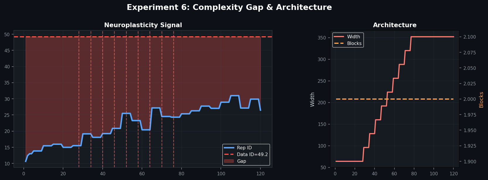
</p>

<p align="center"><em>Rep ID rose from 10.7 to 26.5 against a Data ID of 49.2 — the complexity gap closed by ~46%, remarkably consistent with earlier experiments on synthetic data. The growth controller finds a natural capacity equilibrium.</em></p>

### GradCAM — Watching the Visual Cortex Develop

<table>
  <tr>
    <th>Epoch 0 (Random Initialisation)</th>
    <th>Epoch 120 (Trained)</th>
  </tr>
  <tr>
    <td>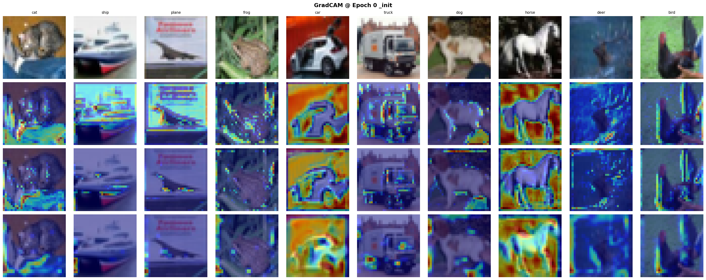</td>
    <td>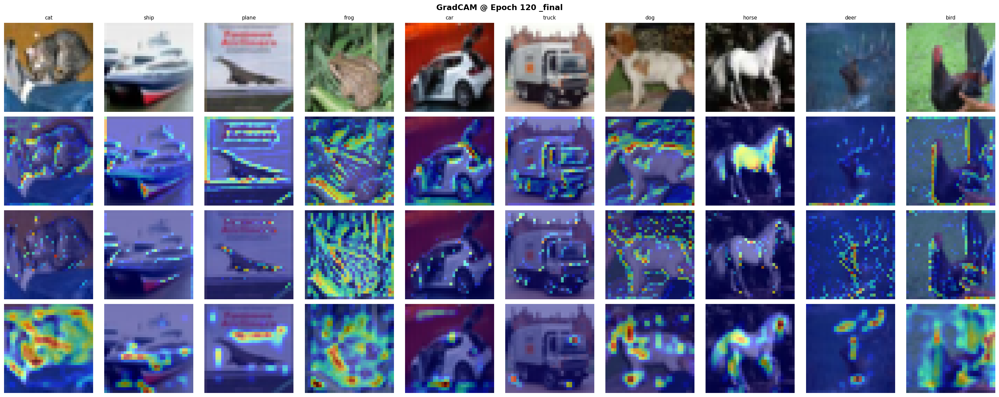</td>
  </tr>
</table>

<p align="center"><em>Conv layers develop hierarchical feature representations: Conv 1 learns edge detection, Conv 2 develops texture/part sensitivity, Conv 3 shows object-level spatial attention. This mirrors the V1→V2→V4 hierarchy from neuroscience, emerging autonomously.</em></p>

<details>
<summary><strong>GradCAM at every growth event (click to expand)</strong></summary>

| Epoch | Event | Snapshot |
|:---:|:---|:---:|
| 28 | Width 64→96 | 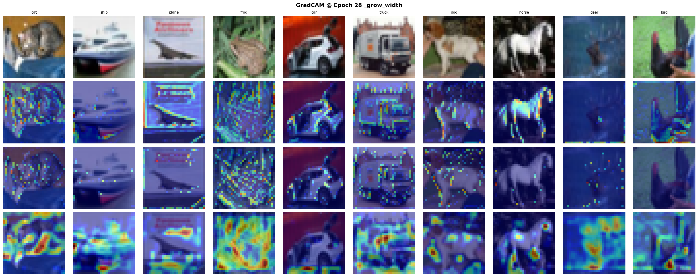 |
| 34 | Width 96→128 | 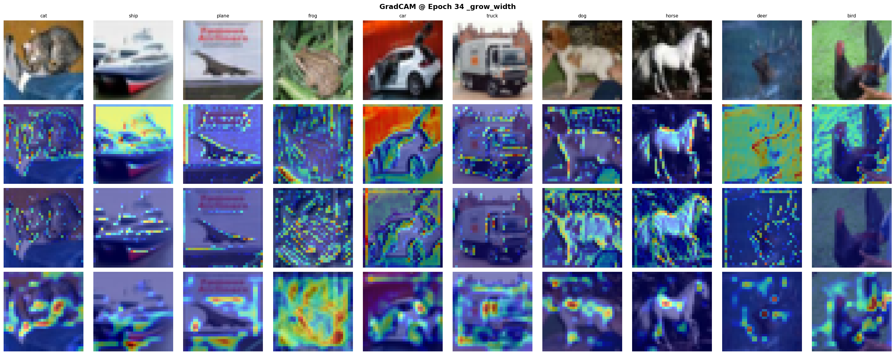 |
| 40 | Width 128→160 | 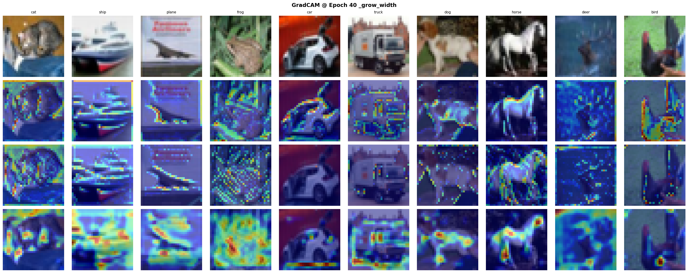 |
| 46 | Width 160→192 | 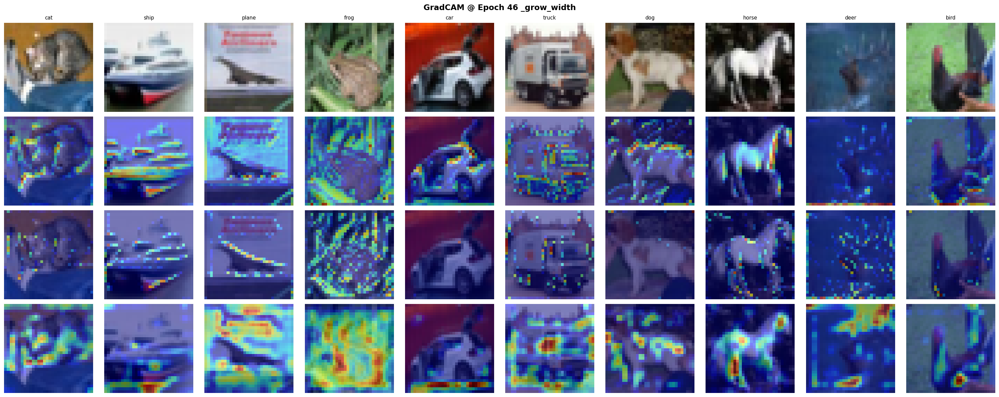 |
| 52 | Width 192→224 | 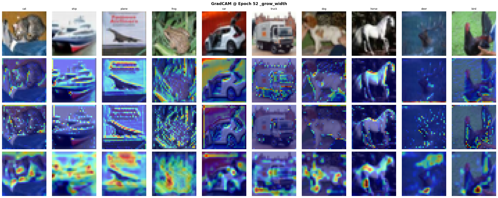 |
| 58 | Width 224→256 | 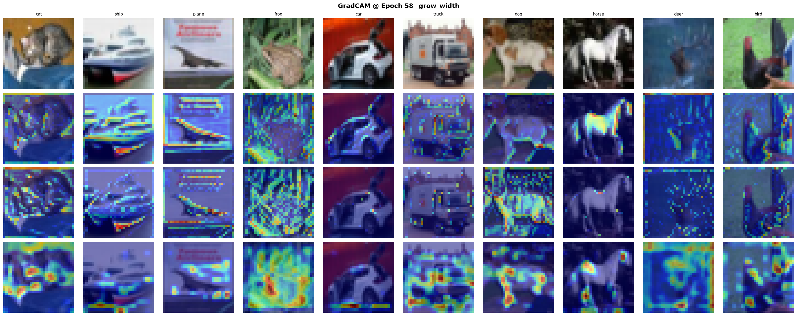 |
| 64 | Width 256→288 | 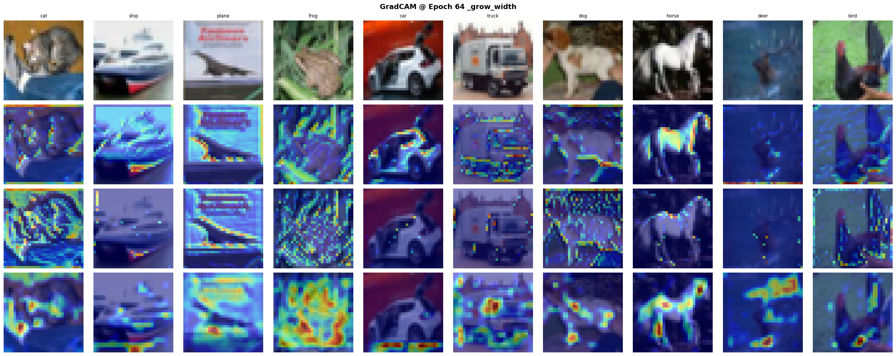 |
| 70 | Width 288→320 | 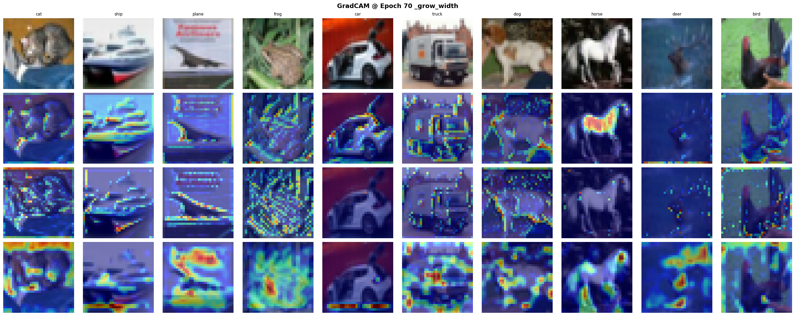 |
| 76 | Width 320→352 | 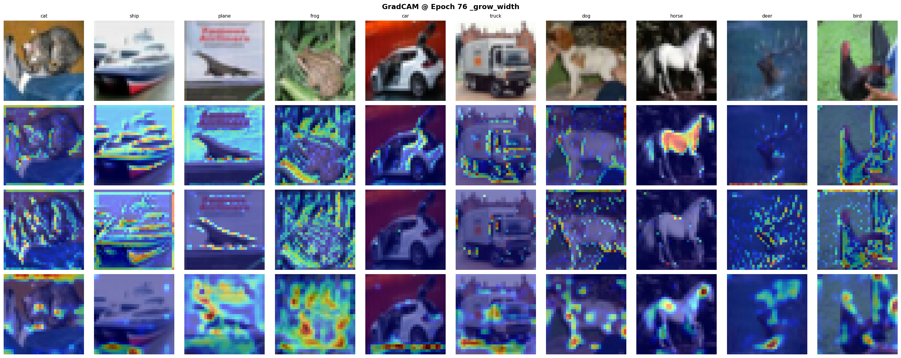 |

</details>

### Growth Event Timeline

| Epoch | Width | Params Before → After | Trigger |
|:---:|:---:|:---:|:---|
| 28 | 64 → 96 | 45,786 → 69,114 | stalled (Δ=0.0027/ep) |
| 34 | 96 → 128 | 69,114 → 100,634 | stalled (Δ=0.0019/ep) |
| 40 | 128 → 160 | 100,634 → 140,346 | stalled (Δ=0.0015/ep) |
| 46 | 160 → 192 | 140,346 → 188,250 | stalled (Δ=0.0015/ep) |
| 52 | 192 → 224 | 188,250 → 244,346 | stalled (Δ=0.0023/ep) |
| 58 | 224 → 256 | 244,346 → 308,634 | stalled (Δ=0.0004/ep) |
| 64 | 256 → 288 | 308,634 → 381,114 | stalled (Δ=0.0010/ep) |
| 70 | 288 → 320 | 381,114 → 461,786 | stalled (Δ=0.0013/ep) |
| 76 | 320 → 352 | 461,786 → 550,650 | stalled (Δ=0.0009/ep) |

---

## The Experiment Journey

This project progressed through six experiments across three phases, each building on the previous findings.

### Phase 1 — Proof of Concept (Pure NumPy)

**Experiment 1: Basic Growing MLP.** Starting from a tiny MLP[96, 4, 4, 10] (458 params) on a synthetic CIFAR-10 analog (96-dim), the growth controller monitored all four IT signals and autonomously grew the network to MLP[96, 64, 64, 10] (13,994 params) across 6 width events. Train: 89.1%, Test: 75.8%. The Data ID–Rep ID complexity gap closed by 47%.

**Experiment 2: Scaling to ResNet-20 Complexity.** Pushed the growing MLP to ~322K params with dataset-informed initialisation (PCsInit + SVD teacher weight projection + LSUV calibration). Reached 100% train accuracy, but test accuracy plateaued at ~76–77% — proving the accuracy ceiling comes from architectural inductive bias, not parameter count.

### Phase 2 — Skip Connections (Pure NumPy)

**Experiment 3: Growing Skip-MLP.** Introduced residual connections with a gradient-checked backward pass (relative error 1.17×10⁻¹¹). The Skip-MLP grew from width-16/2-blocks to width-112/4-blocks (113,242 params) across 8 growth events (6 width + 2 depth). Test accuracy: 53.5% — a **+17.9 percentage point advantage** over the plain MLP baseline (35.6%).

### Phase 3 — Complete System (PyTorch, Real CIFAR-10)

**Experiments 4–5: NumPy Prototype.** Conv front-end + Growing Skip-MLP + BatchNorm + Synaptic Pruning, prototyped in NumPy on synthetic data. The grow→prune→grow oscillation emerged exactly as predicted — 7 growth events interleaved with 7 prune events. Key finding: aggressive pruning right after growth is destructive, mirroring neuroscience where early synaptic pruning harms circuits that haven't specialised.

**Experiment 6: Production Run.** The complete system on real CIFAR-10 with 2D convolutions, data augmentation, cosine LR, and tuned pruning (8% ratio, 15-epoch cooldown, 18% gap threshold). Results: 45,786 → 550,650 params, Train 89.8%, Test 77.8%. Zero prune events — the conv front-end's implicit regularisation prevented the severe overfitting seen in MLP-only experiments. GradCAM confirmed hierarchical V1→V2→V4 feature development.

### Cross-Experiment Summary

| Exp | Architecture | Final Params | Train | Test | Growth | Prune | Key Finding |
|:---:|:---|:---:|:---:|:---:|:---:|:---:|:---|
| 1 | MLP (NumPy) | 13,994 | 89.1% | 75.8% | 6w | 0 | Core mechanism works |
| 2 | MLP + Init (NumPy) | 322K | 100% | 76.7% | 8w | 0 | Inductive bias ceiling |
| 3 | Skip-MLP (NumPy) | 113K | 54.6% | 53.5% | 6w+2d | 0 | Skip advantage +17.9pp |
| 4–5 | Conv+Skip+Prune (NumPy) | 98K | 27.4% | 15.0% | 4d+3w | 7 | Grow-prune oscillation |
| **6** | **Conv+Skip+Prune (PyTorch)** | **551K** | **89.8%** | **77.8%** | **9w** | **0** | **Full system, real data** |

---

## Key Findings

1. **The growth controller works.** Across all experiments, IT signals correctly identify saturation and trigger growth at the right moments. The staircase accuracy pattern confirms Net2Net expansion preserves learned features.

2. **Convolutional inductive bias acts as a regulariser.** The NumPy prototype (no conv) triggered 7 prune events in 70 epochs. The PyTorch system with real 2D convolutions triggered zero. This parallels neuroscience: brain regions with genetically specified wiring (V1) undergo less synaptic pruning than self-organising regions.

3. **The complexity gap is a reliable equilibrium signal.** Both Experiment 1 (synthetic, MLP) and Experiment 6 (real CIFAR-10, Conv+Skip-MLP) closed the Data ID → Rep ID gap by ~46–47%, suggesting the controller finds a natural capacity equilibrium regardless of architecture.

4. **Dataset-informed initialisation matters.** PCsInit (align first-layer weights to data principal components) + SVD teacher weight projection + LSUV calibration gives the growing network a head start that accelerates early training significantly.

5. **Pruning timing is critical.** Aggressive pruning immediately after growth disrupts neurons before they've specialised — a direct parallel to developmental neuroscience where early synaptic pruning can be destructive.

---

## Quick Start

### Google Colab (recommended)

1. Upload `entropy_aware_neuroplastic_learning.py` to Colab
2. Set **Runtime → GPU** (T4 or better)
3. Run all cells (~15–25 min on T4)
4. Results save to `/content/drive/MyDrive/Neuroplastic-NNs/`

### Local

```bash
pip install torch torchvision scipy matplotlib
python entropy_aware_neuroplastic_learning.py
```

### Outputs

| File | Description |
|------|-------------|
| `experiment6_results.json` | Full training history, growth/prune logs, final metrics |
| `experiment6_model.pt` | Trained model weights |
| `exp6_fig1.png` | Accuracy, loss, and parameter growth curves |
| `exp6_fig2.png` | IT signal evolution (Effective Rank, Fisher, MI) |
| `exp6_fig3.png` | Complexity gap and architecture timeline |
| `gradcam_epoch*.png` | GradCAM snapshots at init, every event, and final |
| `checkpoint_ep*.pt` | Checkpoints every 20 epochs (crash recovery) |

---

## Repository Structure

```
Entropy-Aware-Neuroplastic-Learning/
├── README.md
├── entropy_aware_neuroplastic_learning.py     ← Main experiment (PyTorch/Colab)
├── experiment6_results.json
├── requirements.txt
├── requirements_torch.txt
├── .gitignore
│
├── exp6_fig*.png                              ← Result figures
├── gradcam_epoch*.png                         ← GradCAM snapshots
│
├── experiments/                               ← Experiment runners
│   ├── run_experiment6.py
│   ├── run_experiment6_numpy.py
│   ├── run_phase3_skip.py
│   └── run_baseline_mlp.py
│
├── neuroplasticity/                           ← Core library
│   ├── data/cifar_analog.py
│   ├── models/{growing_mlp,skip_mlp}.py
│   ├── growth/{operators,controller}.py
│   ├── metrics/{effective_rank,fisher,mutual_info,twonn}.py
│   ├── init/{pcs_init,teacher,lsuv,pipeline}.py
│   ├── training/trainer.py
│   └── utils/visualise.py
│
├── notebooks/
└── reports/
    ├── neuroplasticity_report.docx
    └── neuroplasticity_final_report.docx
```

---

## References

- **Net2Net:** Chen et al. (2016), *Accelerating Learning via Knowledge Transfer*, ICLR
- **TwoNN:** Facco et al. (2017), *Estimating the intrinsic dimension of datasets*, Scientific Reports
- **Information Bottleneck:** Tishby & Schwartz-Ziv (2017), *Opening the Black Box of Deep Neural Networks via Information*, ITW
- **Effective Rank:** Roy & Vetterli (2007), EUSIPCO
- **PCsInit:** arXiv 2501.19114 (2025)
- **LSUV:** Mishkin & Matas (2015), *All you need is a good init*, ICLR

---

## License

This project is part of ongoing research at the University of Adelaide.
